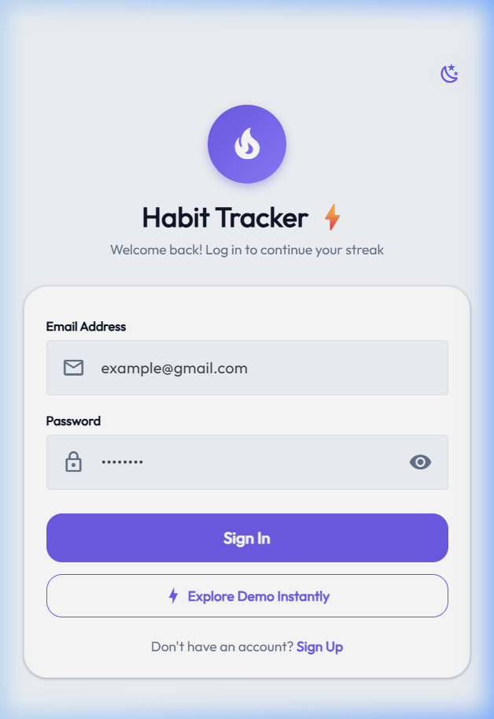
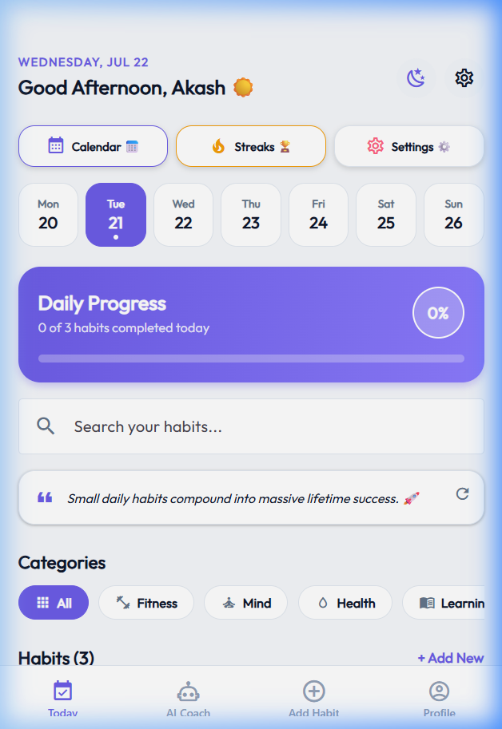
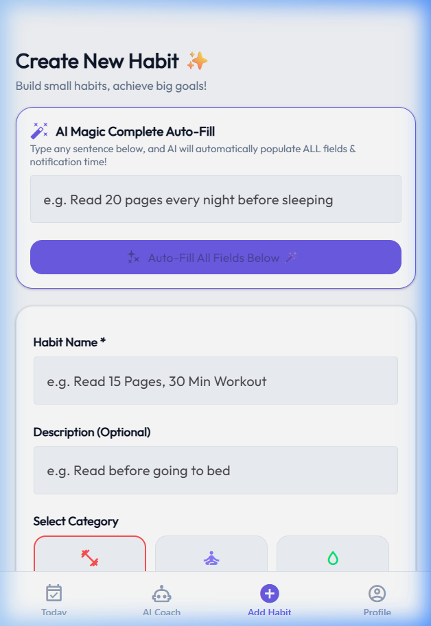
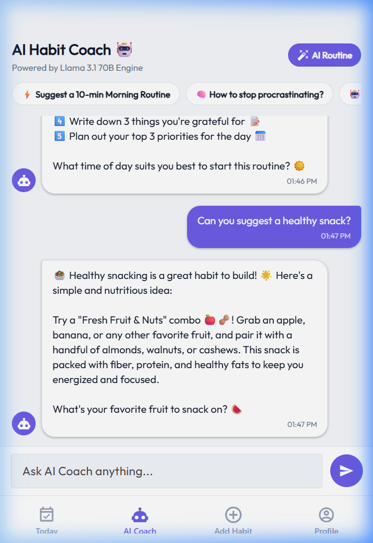
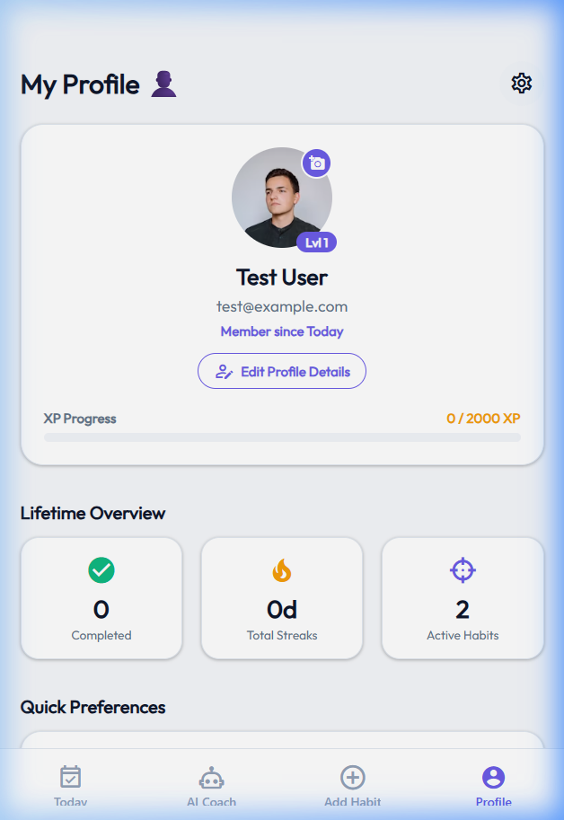

# ⚡ Habit Tracker & AI Habit Coach

A full-stack, cross-platform mobile and web application built with **React Native (Expo)**, **Node.js**, **MongoDB Atlas**, and **Meta Llama 3.1 70B AI** via OpenRouter. 

Track daily habits, earn XP points, build streaks, auto-generate habit routines with AI, and receive personalized coaching from an intelligent AI assistant.

---

## 🟢 Verification & Live Web App Status

- **Web Application**: ✅ Verified working on `http://localhost:8081` (Expo Web)
- **Backend REST API**: ✅ Verified working on `http://localhost:5000` (Node.js/Express)
- **Database**: ✅ MongoDB Atlas connected successfully
- **AI Engine**: ✅ OpenRouter Llama 3.1 70B AI Chat & Routine Generator connected

---

## 📸 App Screenshots & UI Demonstration

| **Auth & Sign In** | **Today Dashboard** |
| :---: | :---: |
|  |  |

| **AI Magic Habit Creator** | **AI Habit Coach (Llama 3.1 70B)** |
| :---: | :---: |
|  |  |

| **User Profile & Stats** |
| :---: |
|  |

---

## ✨ Key Features

- 🎯 **Daily Habit Tracking**: Quick completion toggles, daily percentage progress bar, XP reward system, and streak tracking.
- 🤖 **AI Habit Coach**: Interactive multi-turn chat powered by Meta Llama 3.1 70B for personalized advice, routine suggestions, and overcoming procrastination.
- ✨ **AI Magic Auto-Fill**: Type natural sentences like *"Read 20 pages every night before sleeping"*, and the AI automatically fills out the habit title, category, daily target, unit, and notification time.
- 🏷️ **Smart Categorization**: Organizes habits into Fitness, Mind, Health, Learning, Productivity, or custom categories with search and filtering.
- 🏆 **Gamified XP & Streaks**: Earn 50 XP per completed habit, level up your profile, and keep consecutive day streaks alive.
- 🔐 **Secure Authentication**: JWT-based authentication with bcrypt hashing, profile updates, and Cloudinary avatar uploads.
- 🎨 **Modern Glassmorphic UI**: Beautiful responsive layout designed with smooth animations, dark/light mode toggle support, and clean typography.

---

## 🛠️ Technology Stack

### **Frontend App**
- **Framework**: [Expo](https://expo.dev) / React Native (v0.81) / React 19
- **Navigation**: [Expo Router](https://docs.expo.dev/router/introduction) (File-based routing)
- **UI Components**: React Native Paper, Expo Linear Gradient, Vector Icons
- **Web Support**: React Native Web

### **Backend Server**
- **Runtime**: Node.js & Express.js REST API
- **Database**: MongoDB Atlas with Mongoose ODM
- **Authentication**: JSON Web Tokens (JWT) & bcryptjs
- **Cloud Media**: Cloudinary SDK (Avatar image uploads)
- **AI Integration**: OpenRouter API (`meta-llama/llama-3.1-70b-instruct`)

---

## 📁 Project Structure

```text
habit-tracker/
├── app/                        # Expo Router Pages & Navigation
│   ├── (tabs)/                 # Tab Screens
│   │   ├── index.tsx           # Daily Dashboard & Progress
│   │   ├── add-habit.tsx       # Add Habit + AI Auto-Fill Form
│   │   ├── ai-coach.tsx        # AI Habit Coach Chat Interface
│   │   ├── profile.tsx         # User Profile & XP Level Stats
│   │   ├── calendar.tsx        # Calendar History View
│   │   └── streaks.tsx         # Streaks & Leaderboard
│   ├── auth.tsx                # Authentication (Login/Register)
│   ├── settings.tsx            # App Preferences
│   └── _layout.tsx             # Root Stack Layout
├── assets/                     # App Images & Icons
│   └── screenshots/            # App Screenshots for Documentation
├── lib/                        # Services & API Configurations
│   ├── api.ts                  # Frontend REST API Service Layer
│   └── api-config.ts           # Dynamic API Base URL Config
├── server/                     # Express Backend REST API
│   ├── config/                 # MongoDB Database Connection
│   ├── controllers/            # Auth, Habit, Upload, & AI Controllers
│   ├── models/                 # Mongoose Schemas (User, Habit)
│   ├── routes/                 # Express API Routes
│   ├── .env                    # Backend Environment Variables
│   └── server.js               # Server Entry Point (Port 5000)
└── package.json                # Project Dependencies & Scripts
```

---

## 🚀 Getting Started

### Prerequisites
- [Node.js](https://nodejs.org/) (v18 or higher)
- npm or yarn

---

### 1. Backend API Setup

1. Open a terminal and navigate to the `server` directory:
   ```bash
   cd server
   ```

2. Install backend dependencies:
   ```bash
   npm install
   ```

3. Create/verify the `.env` file in the `server` directory:
   ```env
   PORT=5000
   NODE_ENV=development
   MONGODB_URI=your_mongodb_connection_string
   JWT_SECRET=your_jwt_secret
   OPENROUTER_API_KEY=your_openrouter_api_key
   OPENROUTER_MODEL=meta-llama/llama-3.1-70b-instruct
   ```

4. Start the backend server:
   ```bash
   node server.js
   ```
   *The server will run on `http://localhost:5000`.*

---

### 2. Mobile / Web App Setup

1. Open a new terminal in the `habit-tracker` root directory:
   ```bash
   cd habit-tracker
   ```

2. Install app dependencies:
   ```bash
   npm install
   ```

3. **Run on Web**:
   ```bash
   npx expo start --web
   ```
   *Open [http://localhost:8081](http://localhost:8081) in your browser.*

4. **Run on iOS / Android / Expo Go**:
   ```bash
   npx expo start
   ```
   *Scan the generated QR code using the Expo Go app on your physical mobile device.*

---

## 📡 API Reference Summary

| Method | Endpoint | Description |
| :--- | :--- | :--- |
| `POST` | `/api/auth/register` | Register new user account |
| `POST` | `/api/auth/login` | Authenticate user & get JWT token |
| `GET` | `/api/auth/me` | Fetch authenticated user profile |
| `GET` | `/api/habits` | Get all habits for authenticated user |
| `POST` | `/api/habits` | Create a new habit |
| `PUT` | `/api/habits/:id/toggle` | Toggle habit daily completion & increment streak |
| `DELETE` | `/api/habits/:id` | Delete a habit |
| `POST` | `/api/ai/chat` | Chat with AI Coach (Llama 3.1 70B Engine) |
| `POST` | `/api/ai/parse-text` | Parse natural language sentence into habit details |
| `POST` | `/api/ai/generate-routine` | Generate custom multi-step routine |

---

## 📄 License

This project is open source and available under the [MIT License](LICENSE).
